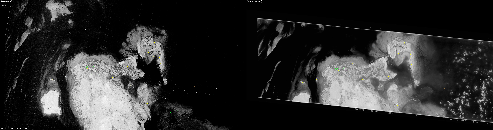

# declass-process

Automated georectification pipeline for declassified Cold War-era reconnaissance satellite imagery acquired by the United States between 1960 and 1984. Given a scanned film frame (or multi-frame strip) and a modern georeferenced basemap, the pipeline estimates and corrects the spatial mapping between the historical image and the reference through a sequence of increasingly fine-grained registration stages. The output is a geometrically corrected GeoTIFF suitable for change detection, land-use analysis, and historical GIS work.



## Supported camera systems

| Designation | Program | Period | Entity prefix | Notes |
|---|---|---|---|---|
| KH-4 | CORONA | 1962–1972 | `DS1` | Panoramic stereo pairs; sub-frame segments stitched into strips |
| KH-7 | GAMBIT | 1963–1967 | `DZB` | High-resolution spot collection |
| KH-9 | HEXAGON | 1971–1984 | `D3C` | Mapping camera; multi-frame `.tgz` archives |

## Entry points

**`process.py`** — End-to-end pipeline: USGS catalog parsing, scene download via the M2M API, archive extraction, frame stitching, rough georeferencing from corner coordinates, alignment against a reference image, and mosaic assembly. All stages are idempotent.

```bash
python process.py --csv catalog.csv --reference reference.tif --output-dir output/
python process.py --csv catalog.csv --auto-reference --entities D3C1213-200346A003
```

**`auto-align.py`** — Alignment-only entry point. Takes a roughly georeferenced input GeoTIFF and a reference GeoTIFF and produces an aligned output. Also accepts strip and block manifests for batch processing.

```bash
python auto-align.py input.tif --reference reference.tif -y
python auto-align.py input.tif --reference reference.tif --anchors gcps.json --qa-json qa.json -y
python auto-align.py --strip-manifest manifest.json
```

### Single-stage entry points

These run individual pipeline stages in isolation, useful for manual preprocessing or debugging. They delegate to the `declass/` modules.

**`stitch_frames.py`** — Stitch consecutive satellite frames into a single panoramic strip. Auto-detects frame ordering and handles 180° rotation correction.

```bash
python stitch_frames.py frame1.tif frame2.tif frame3.tif -o stitched.tif
python stitch_frames.py frame1.tif frame2.tif -o stitched.tif --preserve-order
```

**`georef.py`** — Rough-georeference imagery using USGS XML bounding boxes. Assigns WGS84 coordinates and reprojects to EPSG:3857.

```bash
python georef.py --input image.tif --xml metadata1.xml metadata2.xml
python georef.py  # process all images in the built-in mapping
```

## Alignment pipeline

The core registration pipeline (`align/pipeline.py`) proceeds through the following stages:

1. **Global localization** — When the input lacks usable geolocation or falls outside the reference footprint, a coarse search localizes the image against the full reference at ~40 m/px using land/water mask cross-correlation.

2. **Coarse offset detection** — Land/water mask template matching at 15 m/px, refined to 5 m/px, to estimate the initial translation.

3. **Scale and rotation correction** — ELoFTR dense matching with RANSAC affine estimation (primary), with multi-scale NCC on land masks and gradient images as fallback, to detect and pre-correct geometric distortions before fine matching.

4. **Feature matching** — Dense correspondence estimation using RoMa v2 with a satellite-pretrained DINOv3 backbone (sat493m) on tiled image patches, producing candidate ground control points. Optional anchor GCPs from known landmarks supplement the neural matches.

5. **Filtering and validation** — Iterative outlier removal, RANSAC-based geometric verification, local consistency filtering, and holdout splitting for independent QA.

6. **Grid optimization** — A PyTorch-based optimizer fits an affine baseline plus a learnable per-cell residual displacement field on a hierarchical multi-resolution grid. The composite loss includes GCP fidelity, displacement smoothness, and land-mask chamfer distance.

7. **Flow refinement** — Sub-pixel optical flow at native resolution corrects residual local distortions below the grid cell size.

8. **QA scoring** — Holdout cross-validation on withheld GCPs, shoreline IoU, and regional offset metrics. The pipeline can optionally abstain from producing output when confidence is low (`--allow-abstain`).

## Dependencies

```
pip install -r requirements.txt
```

**Core:** numpy, opencv-python, rasterio, scipy, scikit-image, Pillow

**Neural matching and optimization:** torch, torchvision, kornia

**Vendored models:** `align/romav2/` is checked into the repository for reproducibility.

**System:** GDAL (`gdalwarp`, `gdal_translate`) — install via `brew install gdal` or system package manager.

A CUDA or Apple MPS GPU is recommended. CPU inference is supported but substantially slower for the matching and optimization stages.

## References

1. Edstedt, J., Nordström, D., Zhang, Y., et al. (2025). RoMa v2: Harder Better Faster Denser Feature Matching. *arXiv:2511.15706*.
2. He, X., Yu, H., Peng, S., et al. (2025). MatchAnything: Universal Cross-Modality Image Matching with Large-Scale Pre-Training. *arXiv:2501.07556*. (EfficientLoFTR variant, used for scale/rotation detection)
3. Wang, Y., He, X., Peng, S., Bao, H., & Zhou, X. (2024). Efficient LoFTR: Semi-Dense Local Feature Matching with Sparse-Like Speed. *CVPR 2024*.
4. Teed, Z. & Deng, J. (2020). RAFT: Recurrent All-Pairs Field Transforms for Optical Flow. *ECCV 2020*.
5. Siméoni, O., Vo, H. V., Seitzer, M., et al. (2025). DINOv3. *arXiv:2508.10104*. (Satellite-pretrained sat493m weights via timm, used for both the RoMa v2 backbone and the grid optimizer feature loss)
6. Guo, H., Liu, J., Yang, B., et al. (2022). Outlier removal and feature point pairs optimization for piecewise linear transformation in the co-registration of very high-resolution optical remote sensing imagery. *ISPRS J. Photogrammetry and Remote Sensing*.
7. Lowe, D. G. (2004). Distinctive Image Features from Scale-Invariant Keypoints. *IJCV*, 60(2), 91–110. (SIFT used for frame stitching and alignment validation)
8. Donovan, M. et al. sPyMicMac: TPS-based réseau correction for KH-9 Hexagon imagery. Adapted for film distortion flattening.
